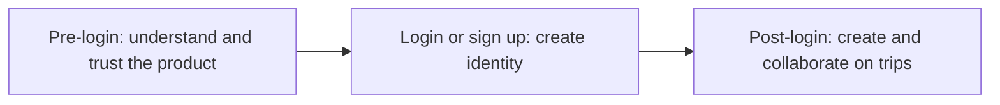
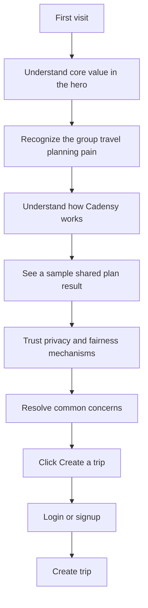

# Cadensy Product Landing Page Plan

This document defines the pre-login product pages: why they exist, which pages are needed, how users move through them, and what each section should communicate.

The goal is not to build every generic SaaS page type. Cadensy only needs the pages that support the first-time visitor journey.

---

## 1. Scope

Cadensy has three broad product stages:



This document covers the first stage:

> Help first-time visitors understand the value, trust the privacy model, and click Create a trip.

Out of scope:

- login and signup forms
- trip creation form
- invite flow
- user dashboard
- AI preference collection
- itinerary generation
- member voting and plan changes

The landing page should still create the correct entry points into those flows.

---

## 2. User Flow



Primary conversion goal:

```text
Create a trip
```

Secondary navigation such as How it works, Privacy, and FAQ should support trust and understanding without competing with the primary CTA.

---

## 3. Needed Pages

| Page type | Needed | Cadensy page |
|---|---:|---|
| Product landing | Yes | `/` |
| Product details | Yes | `/how-it-works` |
| Privacy explanation | Yes | `/privacy` |
| Login | Owned by app flow | `/login` |
| Dashboard | Post-login | `/dashboard` |
| About | Not required | Put short note in footer |
| Subscription | No | MVP is free |
| Blog | No | No content yet |
| Contact | Minimal | Footer email |
| 404 | Later | Simple generic page |

First design set:

1. Home
2. How It Works
3. Privacy
4. Simple 404

FAQ can live on the home page.

---

## 4. Home Page Logic

The home page should follow visitor psychology:

```text
See value
-> recognize the problem
-> understand the mechanism
-> see a concrete result
-> trust privacy and fairness
-> resolve concerns
-> start a trip
```

### Section 1: Navigation

Purpose: show brand, information routes, and main entry points.

Content:

```text
Cadensy
How It Works
Privacy
FAQ
Log in
Create a trip
```

Design requirements:

- Logo on the left.
- Navigation in the center or right.
- `Create a trip` as the clearest filled button.
- `Log in` as text or outline button.
- Sticky navigation while scrolling.
- Mobile menu keeps the CTA visible.

### Section 2: Hero

Purpose: communicate the product in a few seconds.

Recommended copy:

```text
Eyebrow: Group travel, planned together
Headline: Plan a trip everyone can agree on.
Supporting text: Everyone shares their preferences privately. Cadensy balances budgets, resolves conflicts, and improves the itinerary until the whole group is ready to go.
Primary CTA: Create a trip
Secondary CTA: See how it works
Fine print: Free to use. No credit card required.
```

Visual: use a product mock, not a generic travel photo.

Example card:

```text
Tokyo Trip
Plan V3
4 of 5 members ready

Within everyone's budget
Hotel accepted by the group
Days 1, 2, and 4 approved
Day 3 needs one adjustment
```

### Section 3: Problem

Purpose: make visitors recognize the pain.

Show the usual failure pattern:

- group chat has scattered preferences;
- one organizer carries the mental load;
- budgets and limits are awkward to share;
- a small change forces the plan to be rebuilt.

Avoid exaggerating. The tone should feel practical, not alarmist.

### Section 4: How It Works

Explain the workflow in four steps:

1. Create a trip and invite members.
2. Members share preferences privately or publicly.
3. Cadensy generates and checks a shared plan.
4. Changes route through Notice, Round, or Confirm.

Keep the copy short. Link to `/how-it-works` for detail.

### Section 5: Example Outcome

Show one concrete sample result:

- trip name and dates;
- member readiness;
- plan status;
- one compromise explanation;
- one private-constraint-safe message;
- one voting or confirmation card.

The point is to show that Cadensy manages decisions, not just destinations.

### Section 6: Privacy and Fairness

Explain:

- private wording is not shown to the group;
- organizers do not get extra preference weight;
- silence is not counted as agreement in votes or confirmations;
- hard constraints are checked before majority preference.

Recommended headline:

```text
Private inputs. Shared decisions.
```

### Section 7: FAQ

Suggested questions:

- Is this a booking site?
- Can the organizer see my private preferences?
- What happens if people disagree?
- Do I need an account?
- What data is estimated?
- Can plans change after they are generated?

### Section 8: Final CTA

Keep it direct:

```text
Start a trip your group can actually agree on.
Create a trip
```

---

## 5. How It Works Page

Purpose: give a calmer explanation for users who need more confidence before creating a trip.

Suggested sections:

1. Create the trip frame.
2. Collect preferences.
3. Generate a checked plan.
4. Route changes through Notice, Round, Reopen Round, or Confirm.
5. Keep a decision history.

This page should include diagrams or product UI examples, not marketing-only text.

---

## 6. Privacy Page

Purpose: explain what Cadensy protects and what it does not overpromise.

Must say:

- private wording is not shown to organizers or members;
- group-facing outputs use safe summaries;
- small-group anonymity has limits;
- Cadensy does not claim perfect anonymity;
- users control what is public, organizer-visible, or system-only.

Recommended headline:

```text
Privacy that changes decisions without exposing the person behind them.
```

---

## 7. Visual Direction

The landing experience should feel:

- calm;
- premium;
- collaborative;
- travel-specific;
- intelligent without looking like a generic AI dashboard.

Avoid:

- generic airplane hero images;
- stock group-travel photos;
- dark cyberpunk AI visuals;
- oversized feature-card grids;
- vague gradient blobs;
- copy that claims the app automatically makes everyone happy.

Use visual assets that show actual product behavior: itinerary cards, member readiness, privacy-safe notices, and decision cards.

