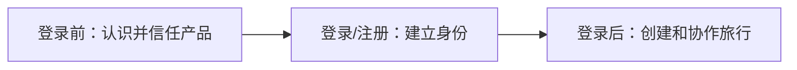
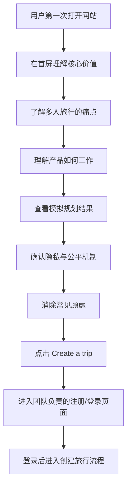
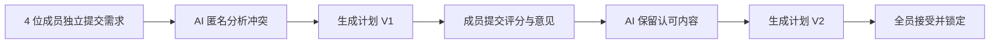

明白了。你现在并不是马上开发页面，而是团队项目刚启动，你需要先把“登录前页面为什么存在、包含哪些页面、用户如何流转、每一部分说什么”整理清楚，随后再进入设计稿。

你提供的截图更像一张“网站页面类型清单”，不是具体页面布局。里面列出了 Dashboard、Landing、Subscription、Log In、Product Details、About 等常见页面。对我们的项目来说，不需要把这些类型全部照搬，只需要选择与当前用户流程有关的页面。就是产品介绍页

# 一、你负责部分的逻辑边界

整个产品可以划分为三个阶段：



你负责第一阶段：

> 让第一次访问网站的人理解产品价值、相信隐私机制，并愿意点击 Create a trip。

你暂时不负责：

- 登录和注册表单
- 创建旅行的信息填写
- 邀请成员
- 用户 Dashboard
- AI 需求收集
- 行程生成
- 成员投票与修改

但你的页面要为这些功能提供正确入口和解释。

# 二、用户进入网站后的逻辑链

## 核心用户路径



这个流程的转化目标只有一个：

> `Create a trip`

“How it works”“Privacy”“FAQ”都是辅助用户建立理解和信任，不应该和主要按钮竞争。

# 三、需要哪些页面

根据截图里的 Page Types，我们只需要选择以下类型。

| 截图中的页面类型 | 是否需要 | 我们的对应页面 |
|---|---:|---|
| Product Page & Landing | 必须 | 首页 `/` |
| Product Details | 需要 | How It Works `/how-it-works` |
| Log In | 其他成员负责 | `/login` |
| About | 暂时不需要 | 可以将项目介绍放在 Footer |
| Paywall & Subscription | 不需要 | 产品免费 |
| Dashboard | 登录后团队负责 | `/dashboard` |
| Profile & Account | 登录后再做 | 不属于你的范围 |
| Blog | 不需要 | 当前没有内容 |
| Contacts | 暂时不需要 | Footer 留邮箱即可 |
| Catalog Page | 不需要 | 产品没有目录 |
| Careers | 不需要 | 早期产品用不到 |
| Developers Page | 不需要 | 暂无开放 API |
| Integration Page | 不需要 | 暂无公开集成 |
| Media Kit | 不需要 | 暂无媒体需求 |
| 404 Page | 后期补充 | 简单通用页面 |

你的第一版可以设计：

1. Home
2. How It Works
3. Privacy
4. 简单的 404 页面

FAQ 直接放在首页，不需要独立页面。

# 四、首页完整逻辑

首页不能只是把功能卡片堆在一起。它应按照用户心理顺序组织：

```text
看见价值
↓
发现这正是自己的问题
↓
理解产品如何解决
↓
看见一个具体结果
↓
相信隐私和公平机制
↓
解决最后的疑问
↓
开始创建旅行
```

## Section 1：Navigation

### 目的

让用户知道品牌、可获取的信息和主要入口。

### 内容

```text
TripSync

How It Works
Privacy
FAQ

Log in
Create a trip
```

### 设计要求

- Logo 在左侧
- 导航在中间或右侧
- `Create a trip` 使用最明显的实心按钮
- `Log in` 使用文字按钮或描边按钮
- 页面向下滚动时导航栏保持可见
- 手机端折叠为菜单，但保留明显的 CTA

---

## Section 2：Hero

### 目的

让用户在几秒内理解产品，不需要先读产品说明。

### 推荐文案

Eyebrow：

> Group travel, planned together

Headline：

> Plan a trip everyone can agree on.

Supporting text：

> Everyone shares their preferences privately. TripSync balances budgets, resolves conflicts, and improves the itinerary until the whole group is ready to go.

Primary CTA：

> Create a trip

Secondary CTA：

> See how it works

补充说明：

> Free to use · No credit card required

### 视觉内容

右侧不要只放一张旅游风景照，建议展示一个模拟产品卡片：

```text
Tokyo Trip
Plan V3

4 of 5 members ready

✓ Within everyone’s budget
✓ Hotel accepted by the group
✓ Days 1, 2 and 4 approved
! Day 3 needs one adjustment

AI update
“I kept the activities everyone liked and
replaced the afternoon hike with two options.”
```

背景可以加入柔和的旅行照片或地图线条，但产品卡片应是视觉重点。

---

## Section 3：Problem

### 目的

让用户产生“这就是我们每次计划旅行时遇到的问题”的感觉。

### 标题

> Group trips shouldn’t require hundreds of messages.

### 内容

可以使用四张人物需求卡：

```text
“I need to stay under $1,500.”

“I want to see as much as possible.”

“I can’t walk for long periods.”

“I’d rather not discuss my budget in the group chat.”
```

总结文案：

> Everyone has different priorities. TripSync gives each person a private voice and turns those needs into one workable plan.

### 设计注意

这部分不要把人物塑造成“制造麻烦的人”。产品需要表达的是每个人的需求都合理，只是需要协调。

---

## Section 4：How It Works

### 目的

用最短路径解释产品机制。

### 标题

> From different opinions to one shared plan.

### 五步流程

#### 1. Create your trip

> Add the destination and dates, then invite your group with one link.

#### 2. Share what matters

> Each person tells AI their budget, preferences, and concerns—and chooses what the group can see.

#### 3. Get a balanced itinerary

> AI builds a plan around everyone’s hard limits and shared interests.

#### 4. Review and improve

> Members rate the plan and request changes. AI keeps what works and updates what does not.

#### 5. Agree and go

> The itinerary is locked when everyone accepts the same version.

### CTA

> See how TripSync works

链接到 `/how-it-works`。

---

## Section 5：Interactive Example

这是首页最重要的产品证明部分。

### 标题

> See how different preferences become one plan.

### 示例场景

```text
5 days in Tokyo · 4 travelers
```

成员需求：

| 成员 | 需求 | 隐私 |
|---|---|---|
| Emma | Stay within a $1,500 budget | Private |
| Noah | Food and nightlife | Shared |
| Mia | Museums and local culture | Shared |
| Liam | Avoid long walking days | Private |

用户点击：

> Build a balanced plan

然后展示模拟 AI 结果：

```text
Budget
The plan stays within every member’s limit.

Hotel
A hotel near two major transit lines reduces travel time.

Activities
Cultural activities are included on Days 2 and 4.

Accessibility
High-walking activities were replaced or made optional.

Group flexibility
Day 3 includes two nearby activity choices and one meeting point.
```

这里暂时不需要真正调用 AI。设计稿可以展示点击前后两个状态，开发时用固定数据实现动画。

---

## Section 6：Core Features

### 标题

> Built for the decisions group trips actually require.

只展示四项核心能力。

### Private by choice

> Share each preference with the group, as a summary, or only with AI.

### Budget-aware by design

> Every shared itinerary is checked against each traveler’s personal budget scope.

### Fair to every member

> Trip creators coordinate the group, but no one can approve a plan for someone else.

### Improved, not restarted

> AI keeps the parts everyone likes and updates only what still needs work.

避免列出大量普通功能，例如“AI-powered”“fast”“easy to use”，这些词无法体现差异。

---

## Section 7：Privacy and Trust

### 标题

> Honest input without awkward conversations.

### 文案

> Budgets, health concerns, and personal preferences can remain private. TripSync uses them when planning without revealing who submitted them.

### 对比示例

```text
What you tell AI privately

“My maximum budget is $1,500.”


What the group sees

“The current hotel exceeds at least one
traveler’s budget.”
```

补充三条：

- You control the visibility of each preference.
- Trip creators cannot view private member information.
- Private feedback is summarized without identifying the member.

CTA：

> Learn about privacy

链接到 `/privacy`。

---

## Section 8：Use Cases

### 标题

> Made for every kind of group trip.

三张卡片即可：

### Friends

> Balance budgets, nightlife, sightseeing, and different travel styles.

### Couples

> Plan together without one person carrying all the decisions.

### Families

> Coordinate shared budgets, children’s needs, accessibility, and different energy levels.

这部分表明产品不只服务某一种用户，但不需要为每类用户制作独立页面。

---

## Section 9：FAQ

建议首版使用以下问题：

### Can other travelers see my budget?

> Only if you choose to share it. A private budget is used by AI when planning, but its amount and owner are not shown to the group.

### What happens when two preferences conflict?

> TripSync explains the conflict without exposing private details, then suggests compromises, optional activities, or nearby group choices.

### Will AI change our destination?

> Only when your group has not locked a destination. Once it is locked, AI plans within that decision.

### Does everyone have to approve the plan?

> Yes. A shared itinerary is finalized only when every active member accepts the same version.

### Can one person upgrade their flight or room?

> Yes, as long as the upgrade does not change the shared schedule or increase anyone else’s cost.

### Are prices and availability guaranteed?

MVP 阶段建议诚实表达：

> Not yet. Early plans may include estimates, which are clearly labeled and should be verified before booking.

真实数据接入后再更新这段文案。

### Is TripSync free?

> Yes. TripSync is currently free to use.

---

## Section 10：Final CTA

### 标题

> Your group already has opinions. Let AI turn them into one plan.

说明：

> Invite everyone, understand what matters, and create a trip the whole group is ready to take.

按钮：

> Create your trip

补充：

> Free to use · No credit card required

---

## Section 11：Footer

```text
TripSync
Plan a trip everyone can agree on.

Product
How It Works
Privacy
FAQ

Account
Log in
Create a trip

Legal
Privacy
Terms

© 2026 TripSync
```

正式上线前需要补充真正的 Terms 和 Privacy Policy。设计阶段可以保留链接位置。

# 五、How It Works 页面逻辑

首页负责快速理解，这个页面负责详细理解。

推荐结构：

1. Hero：`One trip. Every voice included.`
2. 完整五步流程
3. 自然语言如何变成结构化需求
4. AI 如何识别硬性约束与普通偏好
5. AI 如何处理冲突
6. AI 如何根据反馈局部修改
7. 如何达到全员确认
8. Final CTA

重点可以展示一条完整案例：



# 六、Privacy 页面逻辑

这个页面既是产品介绍，也用于建立信任。

推荐结构：

1. `Your preferences. Your choice.`
2. 三种可见性说明
3. 私密信息如何影响计划
4. 团队能够看到什么
5. 创建者能做什么、不能做什么
6. 私密反馈如何匿名汇总
7. 用户如何修改或删除信息
8. 简明 FAQ
9. Create a trip CTA

需要避免做出暂时无法证明的承诺，例如：

- “Military-grade encryption”
- “We never store your data”
- “100% secure”
- “Fully anonymous”

这些属于技术和法律承诺，在团队还没有确定后端实现时不应写入页面。

# 八、你的设计稿交付范围

建议你最终输出：

### Desktop

- Home 完整页面
- How It Works 完整页面
- Privacy 完整页面
- Navigation 展开状态
- Interactive Demo 点击前后状态
- FAQ 展开状态

### 基础设计系统

还需要一页简单的 Design System：

- Logo
- Colors
- Typography
- Buttons
- Form-free information cards
- Status badges
- Spacing
- Border radius
- Desktop and mobile grid

# 九、当前最需要完善的地方

在正式画稿前，还剩三个设计决定，但都可以直接采用默认方案：

1. 暂时使用 `TripSync` 作为工作名称，之后可以全局替换。
2. 首页不做真实 AI Demo，只做固定数据的交互演示。

这三个默认方案都不会妨碍团队同步开发。现在你的逻辑链已经足够完整，下一步应该先画低保真线框图，而不是继续添加更多公开页面。完成线框后，再确定字体、颜色和图片风格。
