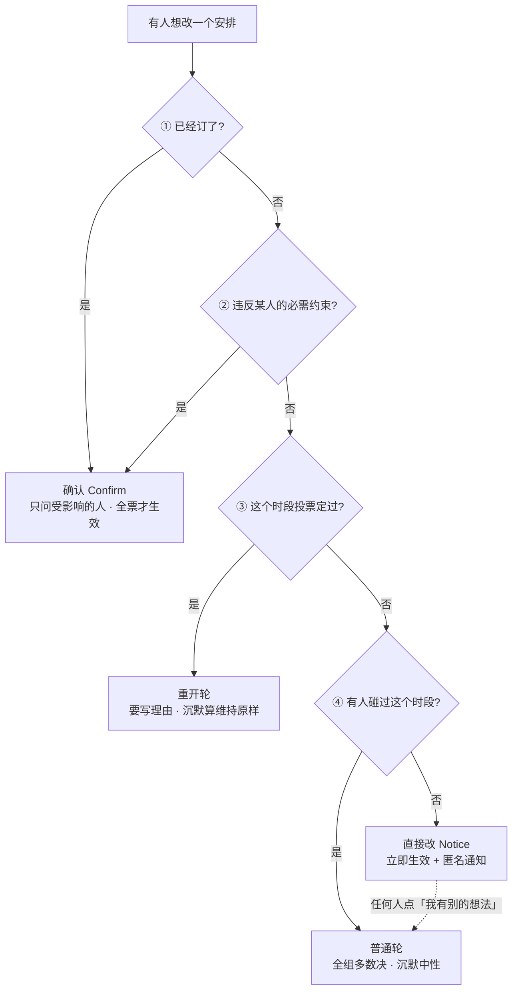
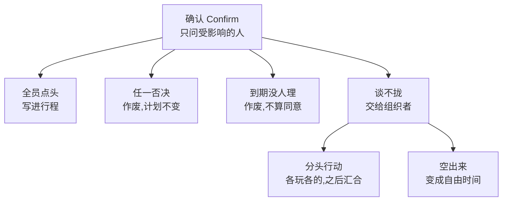

# Cadensy 后端交接

**更新** 2026-08-10
**读法**:接手写代码 → 先读 [`backend/README.md`](backend/README.md);
要看全仓结构 → [`README.md`](README.md);
要看前端整合 → [`INTEGRATION-ROADMAP.md`](INTEGRATION-ROADMAP.md);
要改产品规则 → [`docs/PRODUCT.md`](docs/PRODUCT.md);
要做 AI → [`docs/AGENTS.md`](docs/AGENTS.md);
技术契约 → [`backend/README.md`](backend/README.md);
前端结构 → [`trip/FRONTEND.md`](trip/FRONTEND.md)。

---

## 一、一句话现状

**后端里不依赖 AI 的部分全部做完了,178 条测试守着。前端已接通,Trip workspace 能嵌进主站。剩下的是把真实 AI 质量补上。**

| | |
|---|---|
| 代码 | `backend/`,约 6800 行(含测试) |
| 接口 | **38 个**,http://localhost:8000/docs 可直接点着试 |
| 测试 | 后端 **178 passed**;前端 `npm test` **7 passed**;`trip npm run build` 通过 |
| 数据库 | PostgreSQL,`tripsync` + `tripsync_test` |
| 演示数据 | Mia's 30th in Chicago,6 人 / 9 条安排 / 3 条硬底线 / 真坐标 / 配图 |
| 策展景点库 | **49 个 Chicago 景点**,`backend/data/poi_chicago.py` |
| 前端结构 | `frontend/` 主站 + `/trip` iframe shell;`trip/` 独立 workspace;`shared/` 放跨应用契约 |

## 二、天天要用的三条命令

```bash
# 起后端（--reload 不能少，不然改了代码服务不知道，会看到莫名其妙的 404）
cd backend && MOCK_AI=1 .venv/bin/uvicorn app.api.main:app --port 8000 --reload

# 测乱了重置数据（ID 全保留，前端 .env 不用改）
cd backend && .venv/bin/python -m app.db.reset_demo

# 跑测试
cd backend && DISABLE_SCHEDULER=1 MOCK_AI=1 .venv/bin/python -m pytest -q
```

根目录现在是 `main_sync_fresh/`,所以也可以直接这样跑:

```bash
# 后端测试:178 passed
cd backend && DISABLE_SCHEDULER=1 MOCK_AI=1 .venv/bin/python -m pytest -q

# 主站 + 嵌入契约测试:7 passed
cd frontend && npm test

# Trip workspace 单独构建
cd trip && npm run build

# 把 trip/dist 同步进 frontend/public/trip-app
cd frontend && npm run build:trip-preview
```

> ⚠️ **今天有四次"接口 404"都是同一个原因:进程没重载,跑的是旧代码。**
> 端口被占先 `lsof -ti:8000 | xargs kill`,再用上面第一条起。

### 一个浏览器同时看两种角色

不用改任何文件。前端读身份是 **localStorage 优先**:

```
普通窗口    → 用 .env 里的组织者
无痕窗口    → F12 控制台跑下面这行，变成参与者
```

```javascript
localStorage.setItem('tripsync:membershipId', '参与者的 id'); location.reload()
```

id 这么拿:

```bash
cd backend && .venv/bin/python -c "
from sqlalchemy import select
from app.db.session import SessionLocal
from app.db.models import TripMembership, User
with SessionLocal() as db:
    for m in db.scalars(select(TripMembership)):
        u = db.get(User, m.user_id) if m.user_id else None
        print(m.id, m.role, u.name if u else 'guest')"
```

两个窗口连的是同一个后端、同一个数据库,**轮询 5 秒一次**——
左边改了行程,右边不用刷新就会变。这是真协作,不是演的。

`seed` 和 `reset_demo` 的区别很重要:

| | 做什么 | ID |
|---|---|---|
| `app.db.seed` | 删表重建 | ❌ **全变** → 前端 `.env` 失效 |
| `app.db.reset_demo` | 只清测试痕迹,行程恢复原样 | ✅ **全保留** |

**平时只用 `reset_demo`。**

## 三、做完了什么

| | 状态 |
|---|---|
| 判定引擎(四条路径) | ✅ |
| 三条路径的执行 · 投票结算 · 确认过期作废 | ✅ |
| 决策流水账 | ✅ |
| 创建旅行 · My Trips · 我是谁 | ✅ |
| 邀请 token · 访客/账户加入 · 撤销 | ✅ |
| 密码登录 · Bearer session · 登出 | ✅ |
| 偏好 · 六种约束的增删改 · 冲突扫描 · 成员名单 | ✅ |
| **组织者三件事:催交 · 延长投票 · 僵局出口** | ✅ 前端也已接 |
| 初始行程生成管道(`/plans/generate`) + 规则兜底 + Planner stub | ✅ |
| 对话接口(`/chat`) | ✅ 能理解自然语言、返回 `proposed_change`,但仍是单轮不落库 |
| 条目评论 · booked/unbooked 持久化 | ✅ |
| 地图坐标 · 条目配图 | ✅ |
| 前端:行程 / 改动 / 投票 / 确认 / 角色 / 轮询 / 加入页 / **偏好页** / **成员页** / Chat / Comments / Booked | ✅ |
| 主站和 Trip workspace 的嵌入契约 | ✅ `shared/` + `frontend/public/trip-app/embed-manifest.json` |

## 三点五、2026-08-09 今天补上的东西

这一节是给明天接手的人看的。上面第三节是总状态,这里写今天实际变动。

| 模块 | 今天更新 | 接手提醒 |
|---|---|---|
| Auth | 新增 `backend/app/domain/auth.py`,支持邮箱+密码登录、bearer token、logout、按 trip 找 membership | 权限仍然以 `TripMembership` 为准。一个账号在不同 trip 里的角色不同,不要只看 User |
| API | `backend/app/api/main.py` 扩到 38 个 route | `current_membership()` 同时支持 `Authorization: Bearer ...` 和旧的 `X-Membership-Id` |
| Chat Agent | `/api/trips/{id}/chat` 能把自然语言转成 patch,返回 `proposed_change` 和 verdict | Chat 是只读:它只提出变化,真正落地还要前端调用 `/changes` |
| Agent 基座 | `backend/app/agents/base.py` 支持 `OPENAI_BASE_URL`,DeepSeek JSON object fallback,MOCK 降级,本地 schema 校验 | 所有 agent 只能通过 `safe_context()` 看判定结果,不要绕过去读隐私原文 |
| Explainer | `backend/app/agents/explainer.py` 已按四段式写好:SCHEMA / SYSTEM / MOCK / pure function | 这是其他 agent 的模板 |
| Planner | `backend/app/agents/planner.py` 留了 dataclass 和调用点,但真实逻辑仍是空 | 当前 demo 靠 domain fallback 生成合法行程,不是靠 Planner 智能 |
| Plan generation | `/api/trips/{id}/plans/generate` 已接前端,失败写 `blocked`,成功写 coords/photo/source | 重跑会 409,避免冲掉已有投票/确认/预订 |
| Comments | 新增 trip comments 和 item comments 的读写 | 评论是协作内容,和私密偏好不是一类数据 |
| Booking | 条目可以 mark booked / remove booked,并写入 PlanChange | booked 会影响判定路径,别把它当纯 UI 标记 |
| Organizer actions | 前端已接 Remind、Extend、Escalate、Deadlock split/clear | 组织者仍然不能拍板采用某一方方案 |
| Frontend integration | `frontend/` 和 `trip/` 通过 `shared/` 契约、sync 脚本、embed manifest 连接 | `/trip` 加载的是 `frontend/public/trip-app/` 里的静态 Trip build |
| Shared modules | `shared/tripsync-domain.js`, `shared/tripsync-preview-contract.js`, `shared/tripsync-product-content.js`, `shared/tripsync-demo-data.js` | 改路径/产品文案时优先改 shared,不要两个前端各改一遍 |
| Brand/demo polish | 主站和 workspace 基本切到 Cadensy 表达;旧图片资产从 embed 里移除 | 还有少量 TripSync 命名存在于包名/历史文档,不影响演示 |
| 对话修复 | 用户说“随便/你选/downtown/Michigan Avenue/咖啡店”时,系统应直接给具体候选,再让用户 Apply/Not quite | 这是产品规则:用户已授权 AI 代选时不要继续追问店名 |

今天验证过:

```bash
cd backend && DISABLE_SCHEDULER=1 MOCK_AI=1 .venv/bin/python -m pytest -q
# 178 passed, 1 warning

cd frontend && npm test
# vinext build 通过;Node tests 7 passed

cd trip && npm run build
# vite build 通过
```

## 四、剩下什么

| # | 事情 | 卡在什么上 |
|---|---|---|
| 1 ⭐ | **AI agent 质量** | `OPENAI_API_KEY` 或本地 Ollama/DeepSeek。Chat/Explainer 已有 schema 和调用点;Planner 仍是 stub |
| 2 | Planner 真实选择逻辑 | `app/agents/planner.py::plan_day()` 现在故意返回空,让 domain fallback 接管 |
| 2.5 ⭐ | **Compromise agent(折中生成)** | **规则那一半不需要 API key,可以马上做。** 见 D18 和 `docs/AGENTS.md` 的 Compromise 一节。这是"协商"这半边卖点的落点 —— 没有它,成员的全部词汇量只有 yes/no |
| 3 | 景点库人工核实(价格/营业时间现在是 `ai_estimate`) | 需要人花半小时 |
| 4 | 账户体系补完 | 现在有邮箱+密码登录和 bearer session;magic link、注册、Guest 绑定账户还没做 |
| 5 ⭐ | **Trip 四状态按日期自动流转** | 无。**这条是承重的,不是可选项**:`traveling` 全项目只有 `seed.py:88` 会写,所以 D6 里"旅行中"那一列(投票 2 小时 / 确认 2 天)**从来走不到**,是死代码。而 `models.py:90` 的注释还写着「按日期自动流转」 |
| 6 | 对话记录存库(现在刷新就没) | 建议先接 AI 再决定要不要存 |
| 7 | **继续补 API 端到端回归** | P1/P2 已补上 API 修复和验证,但以后凡是路由调用 helper 的地方都要优先写 TestClient 测试 |
| 8 | **前端去掉写死的 trip/membership ID** | 无。现在 `VITE_TRIP_ID` / `VITE_MEMBERSHIP_ID` 是构建时烤进 bundle 的过渡方案,直接导致第七节那个"僵尸标签页"。接真登录时前端这半边要一起改成运行时获取(D10 只覆盖了后端那半边) |
| 9 | **`PATCH /api/trips/{id}`** | 要先定规则:已经生成行程之后还允不允许改日期,改了已有条目怎么办(顺移/清空/禁止)。见第九节待决 3 |
| 10 | **景点库扩容或允许重复** | 现在整趟旅行不允许重复景点,直接决定了 `MAX_TRIP_DAYS = 16`。长途旅行本来就会重复去同一个区域,这是产品判断 |

**答辩可以砍掉且看不出来的**:4。(5 原本在这里,现在不能砍 —— 见上)

## 五、关键决策与理由

改之前先看一眼,否则容易把想清楚的坑再踩一遍。

### D1 · 判定用死规则,不用 AI
模型同一个问题问两次可能给不同答案。一个以公平为卖点的产品,规则本身不能飘。
**AI 只在用户写下约束的那一刻出场**,翻译结果存下来,之后判定只读存下来的规则。

### D2 · 约束只有六种类型,不是自由文本
自由文本无法被确定性判定。填不进六种的,系统**老实说"这条我保护不了"**,不假装。

### D3 · 隐私靠结构,不靠"记得过滤"
三层:原话单独一张表 / 判定结果的类型里装不下身份 / 通知表没有 actor 字段。
判定结果里出现姓名或原文,卖点当场作废——有测试守着。

### D4 · 加了第四条路:重开轮
原设计的"多人联署"要求私下拉票,而拉票正是本产品要消灭的行为,已删除。
**曾考虑让它走 Confirm,否决了**:Confirm 要全票且当时没有截止,反而更僵。

### D5 · 沉默的含义按路径分档
首次决定:没投票 = 中性。重开推翻已定的事:没投票 = **算在"维持原样"这边**。

### D6 · 确认也有截止,到期**作废**不是通过

**到期通过 = 把没回复算成同意,这条绝对不能破。** 这是 D6 的核心,不许动。

**当前代码里的窗口(已落地):**

| | 规划中 | 旅行中 |
|---|---|---|
| 投票 Round | 24 小时 | 2 小时 |
| 确认 Confirm | 48 小时 | 4 小时 |
| 可延长 | ✅ 一次:投票 +24h,确认 +24h | ✅ 一次:投票 +2h,确认 +2h |

> 已落地:Trip 状态现在由 `trip_status(trip, today)` 按日期派生,
> `trip.status` 只作为展示/查询缓存,由 scheduler 顺手同步。演示种子日期也改成
> 相对今天,保证 demo 永远处于 traveling。

**为什么 7 天太长 —— 不是"等太久",是那个时段被冻住了。**
`_guard_not_pending` 会在有 `waiting_affected_members` 的提案时拦下**任何**
对该条目的新改动。所以:一个人没回复 → 这个时段 7 天内谁都不能动 →
大概率到期作废 → 计划一个字没变。**七天的瘫痪,换一个"什么都没发生"。**
而确认要的只是 1–2 个人回一个 yes/no。

**为什么旅行中 2 天是错的。** 它可能比剩下的行程还长(四天的行程第二天开提案,
截止在行程结束之后)。而且同一趟旅行里,低风险的事 2 小时定、高风险的事拖 2 天,
这个不对称说不通。

**缩短是安全的,这点是关键。** 确认到期是**作废**,失败方向偏向"什么都不变" ——
所以短窗口**只对提案人不利,对被保护的那个人毫发无伤**(他不回复就等于守住了)。
既然如此,就没有理由为了"公平"而留长窗口。

**确认也允许延长一次。** 和投票的 `extend_round` 对称,但到期仍然是作废,不是通过。
**缩短 + 可延长** 比 **一直很长** 好:默认快,卡住了再放宽,
而不是所有情况都按最坏情况等。

**另见 D19** —— 比这些数字更重要的那条原则。

### D7 · 确认只拉真的被影响的人
碰到一个人的硬底线 → 只问那 1 个 + 发起人。已订的东西 → 全组(钱是大家的)。
拉太宽的后果是提案永远凑不齐,那个时段被无限期占住。

### D8 · 关键不变量下沉到数据库
"一个条目同时只能有一轮开着的投票"用部分唯一索引强制。
应用层再拦一道给用户人话(409)。**两道都要:应用层管体验,数据库管正确。**

### D9 · 改严了只报告,不自动改行程
自动修复要等 Planner agent。现在诚实地列出撞到哪几项,让用户自己决定
是改行程还是放宽要求——这个选择本来也不该系统替他做。

### D10 · 身份现在是双轨
真实登录走 `Authorization: Bearer <token>`;demo 和调试仍保留 `X-Membership-Id`。
权限判断仍然落在 `TripMembership`,不是 `User`。同一个账号可以在 A trip 是 organizer,
在 B trip 是 participant,所以所有 trip 内接口都要带 trip 上下文。

### D11 · 组织者只有两个出口,两个都是"不做决定"
确认谈不拢时升级给组织者,他能做的只有**分头行动**或**空出来**。
**没有第三个选项** —— 能采纳任何一方方案的组织者就是超级用户,
"组织者的偏好不享有更高权重"当场就破了。
有一条测试专门守着这个,尝试四种"拍板"写法全部被拒。

### D12 · 催交是私人的,不是公开点名
提醒只发给那一个人。当众点名会把"还没填"变成压力,
和"沉默不算同意"是一个东西的两面。同一个人 24 小时内只能被催一次。

### D13 · 初始行程是管道,Planner 只负责挑
`POST /api/trips/{id}/plans/generate` 现在先过滤合法 candidates,再调用 Planner agent,
失败或返回不可用结果时退回确定性规则。每天排 10/14/19,成功才写 `PlanItem`,
失败写 `Plan.status = blocked` 和脱敏原因。
`app/domain/plans/generator.py` 已经负责约束、预算、开门时间、重试、验证、写库和兜底。
项目负责人只需要补 `app/agents/planner.py::plan_day()` 的 prompt/schema/选择逻辑。

两条门槛也在 domain:组织者没交自己的偏好 → 422;已经有任何 PlanItem → 409。
这样不会把组织者的硬底线漏出求解,也不会冲掉已经投票/确认/预订过的安排。

### D14 · 用户授权 AI 代选时,不要继续追问
今天 Cadensy 对话暴露了一个产品问题:用户说“随便”“你选”“换到 downtown 的咖啡店”
时,系统还反复要求用户给具体店名。这个不对。

正确规则:用户给了目标类别/区域并授权 AI 选择时,系统应该先给一个具体候选,
展示 Before / After 和影响判定,再让用户点 Apply 或 Not quite。
例子:`Lula Cafe` → `Starbucks Reserve Roastery, 646 N Michigan Ave`。
这不是偷偷改计划,因为 Current Plan 仍要等用户确认才写入。

### D15 · 匿名保护结构化的约束,实名承载自由的意见,两者不混

| | 通道 | 身份 | 内容 |
|---|---|---|---|
| 约束 | 六种类型 + 判定引擎 | **匿名**(结构上装不下身份) | 我 9 点前起不来、我预算 500 |
| 意见 | 条目评论区 | **实名**,全组可见 | 这家店评价不错、要不要换一天 |

**评论区实名不是疏漏,是对的。** 施压来自"定向 + 私密 + 有未决事项",不来自实名。
公开场合责任对称 —— 说重话的人自己也被看见,人会克制。
真正有毒的组合是**匿名 + 公开**:零成本地阴阳怪气、带节奏,没人能追责。
6 人小组里尤其如此:一条匿名评论混在实名评论里等于打了束聚光灯,所有人都在猜是谁。

**匿名承诺一直是有边界的** —— 保护偏好和硬底线,不保护"我觉得这家贵"这类普通意见。
把匿名扩大到所有发言,匿名本身就贬值了:
它会从一个精确的结构保证,退化成一种模糊的氛围。

**两条硬线:**

1. **评论区不得成为决策入口。** 评论不影响判定、不计票、不改变路径 ——
   组织者在评论区说十遍"我很想去"也不会让那个条目更容易通过。
   以后如果有人提"评论点赞多的方案优先"之类,那是在拆地基,直接否掉。
2. **任何一个界面都不许把两条通道混在一起。**
   在匿名语境里放自由文本框 = 漏。这正是 tradeoff 页面不能有输入框的原因(见 D16)。

有一个风险是接受的:实名评论区里有人可能自己说漏("这个太贵了吧"),
等于自曝了预算约束。**不拦。** 产品承诺的是"系统不会替你说出去",
不是"禁止你自己说" —— 和 D2 一个精神,不假装。最多在首次输入时提一句
"这里是实名的,全组可见",让人知情,不替人决定。

### D16 · 冲突确认页不做对话,这是立场不是缺口

走到 Confirm 的场景里,两个人之间真正要传的只有三种信息:**不行 / 这样不行但那样行 / 行**。
全是结构化的。唯一需要自由文本的是**"为什么"** —— 而"为什么"恰恰是产品承诺不传递的东西。
**能传的部分不需要对话,需要对话的部分不能传。**

而这是全流程里**唯一一个"交流必然变成施压"的时刻**:一对一、对方握着一票否决权、
还有个钟在走(D6)。所以这里给聊天框,等于亲手造一条定向施压管道 —— D4 删多人联署
删掉的就是这个东西。

**这个产品在其他所有时刻都欢迎交流,恰恰是为了在这一个时刻能理直气壮地不提供它。**

那"人被拒时需要被听见"呢?这个需求是真的,但**不需要对方在场** ——
去个人对话里对 Cadensy 说,他就被听见了。所以 tradeoff 页面留一个
"想说点什么?和 Cadensy 聊 →"的出口,而不是一个输入框。

落地状态(2026-08-10):已在代码里删掉冲突确认页的假聊天输入框和本地假回复,
改成结构化提案卡 + Cadensy 私聊出口;Decline 已加二次确认,确认页已显示作废倒计时。

判断该不该开放定向交流,只有一条判据:**有没有一个未决事项正压在某个具体的人头上。**
有 → 别定向;没有 → 交流是纯收益。

### D17 · 投票解决分歧,确认保护底线 —— 两套机制不是重复,是分层

最容易被追问的一条:"投票和确认有什么区别,为什么要两套?"

**判据只有一句:输的那个人,是「没得到想要的」,还是「承受了他承受不了的」?**

去博物馆还是去公园,输了只是不如意 → **多数决是对的**。
你的预算只有 500,输了是真掏不出来 → **多数决就是五个人对一个人行使权力**。

所以 `engine.py` 的判定顺序把 `booking` 和 `required` 排在最前面 ——
它们是"承受不了"的信号,一命中就锁死在确认这条路上,**再也回不到多数决**。

| | 投票(Round) | 确认(Confirm) |
|---|---|---|
| 触发 | 有人碰过 / 已定过 | 已订 or 违反某人 `required` |
| 参与 | **全组** | **只有真被影响的人** + 提案人 |
| 规则 | **多数决** | **全票,一人否决即废** |
| 沉默 | 首次=中性,重开=维持原样(D5) | **没有沉默这回事** —— 到期作废(D6) |
| 输的人失去 | 想要的 | 承受不了的东西 |

"沉默"那一行最能体现分野:**投票会因为没人说话而产生结果,确认永远不会。**

**两个 split 也不一样**(这个最容易绕住):投票选项里的 split 是一个**候选项**,
它赢是因为大家选了它 —— 集体意志。僵局出口的 split 是**没有共识时的兜底**,
组织者不是"选择了分头行动",而是承认这里达不成一致 —— 集体意志的缺席。
同一个外观,一个是结果,一个是没有结果。

**为什么不能只留一套:**
全用投票 → `required` 当场失效,声明"我预算 500"没有任何保护力,六种约束体系塌掉。
全用确认 → 任何一个人都能一票否决任何小事,行程永远动不了。

一句话版本(答辩可以直接用):
> **投票解决分歧,确认保护底线。分歧可以少数服从多数,底线不行 ——
> 所以底线谈不拢的时候,出口是把事情拆开,而不是让多数把少数压过去。**

### D18 · 折中方案由 Cadensy 生成,不由人提

**这条是"协商"这半边卖点的落点。定这条之前,产品只会裁决,不会创造。**

**问题。** 走到 Confirm 的人,全部词汇量只有 **yes / no**。投票也只有固定三项
(`keep` / `requested` / `split`),**成员不能加自己的选项**。
系统很公平地裁决,但从不产出第三个方案 —— 而折中才是协商的本质:
协商不是"选谁赢",是**造出第三个方案**。

**为什么不能让人来提。** 人要提折中,必须先知道对方卡在哪 ——
**而"知道"就意味着有人说出来了,那就是泄露。**
这是这个产品正中央的死结:想折中就得暴露,想保密就折不了中。

**Agent 是系统里唯一能同时看见所有约束的参与者。**
所以它是唯一能算出"同时满足所有人硬底线的方案"、而**没有任何人开过口**的角色。
这不是"用 AI 提效",**这是"协商"和"私密"能同时成立的唯一方式。**

**不违反 D1。** D1 管的是**判定**用死规则。**提出候选不是判定** ——
agent 造出来的方案照样过一遍 `classify()`,该走哪条路走哪条路。
**Agent 提出,规则处置。** 这就是 D13(「Planner 只负责挑」)的模式再用一次,
不是新架构。

**必须拆成两半:**

| 部分 | 谁做 | 用什么 |
|---|---|---|
| **可行域**(哪些时段同时满足所有硬底线) | **死规则** | `_legal_slots()` / `_candidate_valid_after()` / `_budget_headroom()` / `violates()` —— 全部已存在 |
| **在可行域里挑哪个 + 选哪句脱敏文案** | AI | `SAFE_TEXT` 六选一 |

**这么拆有个很现实的好处:规则那一半不需要 `OPENAI_API_KEY`。**
你现在卡在没有 key(待办 1),但规则版本已经能产出真实的第三选项,
AI 接上之后只是挑得更聪明。**先做规则那一半。**

**三条红线:**

1. **只提出,永不落地。** 产出候选,进现有的投票/确认机制。和 `/chat` 只读同一条纪律。
2. **输出必须被 schema 锁死**:`{patch, safe_reason}`,`safe_reason` 是
   `SAFE_TEXT` 的 key。**模型负责理解,不负责措辞** —— 它要是自由写出
   "改到下午因为有人早上起不来",当场就漏了。
   更彻底:喂进 prompt 前把 `Constraint` 的 `membership_id` 和 `private_note` 剥掉,
   只给 `kind` + `params`。**它连"这条是谁的"都不知道,就不可能归因。**
3. **算不出来要老实说。** 没有任何时段能同时满足所有硬底线时就说"没有" ——
   这个结论是**可证明的**(可行域是算出来的),不是模型猜的。这是 D2 的精神。

**落地形态。** 投票里多一个选项(`Cadensy 找到的方案`),
确认页上被挡住的人多一个动作(「否决 → 让 Cadensy 找替代」)。
**提折中的是 Cadensy 而不是被挡住的那个人 —— 更好,因为他连开口都不用。**

> 附带解决:原先担心"人来回反提案没有上限会变成另一种拉票",
> agent 一次产出候选、全组同时投票,**来回的通道从来没打开过**。

一句话版本(答辩可以直接用):
> **我们不是让大家少说话,是让每个人不用开口就能被听见。**
> **投票让你不必说服谁,Cadensy 提的折中让你不必解释为什么。**

详细规格见 [`docs/AGENTS.md`](docs/AGENTS.md) 的 Compromise 一节。

### D19 · 任何截止时间都不得晚于这件事本身发生的时间

**现状是错的:**

```python
def _deadline_for(trip):           # 只看 trip.status
def _proposal_deadline_for(trip):  # 也只看 trip.status
```

**两个都不管这个条目是哪天的事。** 后果很具体:**周六晚餐的投票,可能在周日才截止。**
规划期开一个关于明天午餐的投票,窗口 24 小时 —— 等它结算,午餐已经吃完了。

**这不是调参数能解决的,是结构不对:**

```python
deadline = clamp(now + 30min, now + window, 条目开始时间 - 30min)
```

> 已落地:投票和确认共用同一个 deadline helper。下限不能漏,否则一个 10 分钟后开始的
> 活动会算出过去的截止时间,提案一创建就过期。

**有了这条原则,上面那些数字定得松一点也不会出洋相** ——
三个月后的行程给 48 小时,明天的事自动收紧到今晚。

**这条比 D6 里任何一个数字都重要**,因为数字只是松紧不合适,
而"在事情发生之后才截止"是荒谬。

### 判定与出口全景图

一个改动进来,怎么决定走哪条路(命中即停):



确认这条路的四个出口 —— **没有一个是「接着谈」**:



组织者那两个出口**都是「不做决定」**,没有第三个按钮(D11)。

### 明确删掉的
Lock / Final 发布 / 满意度评分 / 三种锁定模式 / 多人联署 / "弃权"记录 /
**重开轮的 48 小时冷却期**(演示遇不到,而且有"要写理由 + 过半数"两道门槛已经够) /
**冲突确认页的聊天输入框**(见 D16。现在那个框是假的:只进本地 state,
不落库、对方永远看不到、刷新就没,还自动回一句 "Noted." 制造被听见的错觉 —— **已在 2026-08-10 删掉,实际做法是保留结构化确认卡,下方只给 Cadensy 私聊出口**)。

## 六、AI 接入(你要做的那块)

**Agent 不能绕过产品规则。现在有五个入口,其中只有两个会写 Current Plan 或 PlanItem:**

| 门 | 干什么 | 状态 |
|---|---|---|
| `POST /api/plans/items/{id}/classify` | 试算,不执行。**免费、瞬间**(判定不调 AI) | ✅ |
| `POST /api/plans/items/{id}/changes` | 真提交,后端自己判定走哪条路 | ✅ |
| `POST /api/trips/{id}/constraints` | 写用户的约束 | ✅ |
| `POST /api/trips/{id}/chat` | 自然语言理解 + 返回 proposed_change,**只读不执行** | ✅ |
| `POST /api/trips/{id}/plans/generate` | 初始行程生成,先过滤合法候选再让 Planner 选择 | ✅ domain 好了;Planner 仍是 stub |

地基也铺好了:

- `app/agents/base.py` —— `safe_context()` 是 agent 拿判定信息的**唯一入口**,
  返回的类型里装不下身份和原话;`call_model()` 封了 MOCK 开关、
  `json_schema strict`、DeepSeek JSON object fallback、本地 schema 校验、超时降级
- `OPENAI_BASE_URL` 可配 —— 换 DeepSeek / Ollama / OpenAI 兼容供应商只改 `.env`,代码不动
- `app/agents/chat.py` —— 负责 understand / explain / answer_question,但不落库
- `app/agents/explainer.py` —— 最完整模板,其他 agent 照这个四段式补
- `app/agents/planner.py` —— 目前故意空实现,让规则兜底跑完整 demo

**五条红线和五个 agent 的规格,全在 [`docs/AGENTS.md`](docs/AGENTS.md)。**

## 七、已知的坑

| 坑 | 说明 |
|---|---|
| **进程不重载** | 起后端必须带 `--reload`。今天四次 404 都是这个 |
| **走路距离约束基本不生效** | `day_walk_km_after` 目前恒为 0,因为没有路程数据。景点库有坐标,可以算,但还没接 |
| **6 人小组的匿名是脆的** | "有一条要求不能早于 9 点"可能一猜就中。对外别说"完全匿名" |
| `seed` 会换 ID | 只用 `reset_demo` |
| 没有 Alembic | 现在靠 `create_all` + 手动 `ALTER`。表结构稳定后必须加迁移工具 |
| 定时任务跟着后端进程跑 | 部署**不能用 Vercel** 那种按需唤醒的。用 Railway / Render |
| 对话记录不落库 | 刷新就没 |
| Planner 看起来能生成,但智能还没接 | `plan_day()` 现在返回空 tuple,合法行程来自 domain fallback |
| `/trip` 不是直接读 `trip/src` | 主站 iframe 读 `frontend/public/trip-app`;改完 `trip/` 后要跑 `cd frontend && npm run build:trip-preview` |
| 本地沙箱可能误报测试失败 | 后端测 PostgreSQL 需要连 `localhost:5432`;前端 build 会写 `node_modules/.vite-temp`。被 EPERM 拦时,不是代码坏了 |
| 有些测试守的是产品承诺 | 改它们之前先确认产品真改了主意,别为了让测试过而改测试 |
| **前端把所有 500 说成"连不上后端"** | 见下面 P2 |
| **换过 ID 之后,旧页面会变僵尸一直轮询** | 一条 `lsof -nP -iTCP:8000` 就能指名道姓。注意内嵌浏览器也算(上次真凶是 ChatGPT.app 的 Codex 预览页)。见下面"僵尸标签页" |
| **旅行创建之后改不了** | **没有 `PATCH /api/trips/{id}`。** 名称、目的地、日期一旦填错就只能重建。见下面"一趟旅行最多 16 天" |
| **`budget_visibility` 是个空承诺** | `planning_only / organizer / everyone` 存进库了,但**全项目没有任何一处读它**来决定展示。目前实际行为是"谁都看不到别人的预算"(比承诺的更严,所以不是泄露),但用户在 UI 上选的那个开关不接任何东西。要么接上,要么从 UI 拿掉 |

### 2026-08-09 修掉的两个 500

两个都在第八节的验证清单里(步骤 4 和 5),之前走那一遍不会发现,
因为它们都要求**同一个时段上已经有一轮投票开着**才触发。

**P1 · 「I have a different idea」撞唯一索引 → 500**
`POST /api/updates/{id}/object`。`object_to_notice()` 直接建新 round,
唯独漏了 `_guard_not_pending()` —— 而 `propose_change()` 是走了的。
同一条目已有开着的轮次时,数据库的 `one_open_round_per_item` 把它拦下,
抛 IntegrityError 没人接。**这正是 D8 说的"两道都要"里应用层那道漏了**。
修法:`orchestrator.py` 里补 `_guard_not_pending(db, item)`,
`main.py` 接住 `AlreadyPending` → 409。前端对 409 是弹 toast,不是红色错误条。

**P2 · 投票接口每次都 500,而且看起来像"慢了 5 秒"**
`POST /api/rounds/{id}/votes`。票写进去也 commit 了,炸在最后一行
`return get_round(round_id, db)` —— **在路由函数里直接调另一个路由函数**。
`get_round` 的第三个参数默认值是 `Header(default=None)`,走 HTTP 时 FastAPI 会替换掉,
直接用 Python 调它则不会,于是 `x_membership_id` 拿到的是 `Header` 对象本身。
它非 None,被当成主键塞进 `db.get()` → psycopg 不认这个类型 → 500。

界面上的表现具有欺骗性:**票其实投上了,只是响应炸了、界面不更新,
要等 5 秒后的下一次轮询才显示。看着像"后端好慢",实际接口只花 15 毫秒。**
凡是"延迟正好等于 5 秒"的现象,先怀疑是这个 —— 那是轮询间隔,不是耗时。

修法:把函数体抽成普通 helper `_round_payload(db, round_id, membership_id)`,
路由只做转发,`vote` 和 `settle` 两个内部调用点显式传 id。
**规矩:要复用逻辑就抽 helper,永远不要直接调路由函数。**
全项目只有这两处,都已修。

**两条留给下一个人的教训:**

1. **后端 500 在界面上会显示成 `Backend request failed / Could not reach the backend.`**
   ——那是 `TripAppState.jsx` 的兜底文案(`!err.status || err.status >= 500` 都归这一句),
   **不代表后端真的连不上**。看到它先去后端终端看 traceback,别去查网络。
2. 后端如果起在 `--log-level warning`,traceback 只出现在跑 uvicorn 的那个终端窗口里。
   调这类问题时把它开着。

### 僵尸标签页:后端日志里刷一堆不存在的 trip id

**症状。** 后端日志里出现一组用着**数据库里已经不存在的 trip id** 的请求,
稳定 404 + 401,关不掉、删文件也不管用:

```
GET /api/trips/<旧 id>            404      ← 僵尸,每 5 秒一轮
GET /api/me                       401
GET /api/trips/<新 id>            200      ← 正常页面,也是每 5 秒一轮
```

**最容易认错的一点:它不是持续刷屏,而是跟着你切标签页红绿交替。**
硬刷新完盯一会儿全是绿的,过一阵又变成全红,像是代码自己翻回了旧版本 ——
不是。原因在 `TripAppState.jsx` 的轮询门控:

```js
if (cancelled || document.visibilityState !== 'visible') return
```

**只有当前可见的标签页才轮询,切走立刻停。**于是:

| 你在做什么 | 日志 |
|---|---|
| 看着刚硬刷新的那个标签页 | 只有它在轮 → **全绿** |
| 切到另一个标签页 | 好的那个停了,僵尸变可见开始轮 → **全红** |

红绿交错的那几行,是切换的一瞬间两边都还在跑。
**看到这种交替不要排除僵尸这个方向 —— 交替恰恰证明僵尸还开着,而且就在手边。**

**原因。** 三件事凑一起:

1. `app.db.seed` 会换掉所有 ID(`reset_demo` 不会)
2. trip id 和 membership id 是**构建时写死进 bundle 的**(来自 `trip/.env` 的
   `VITE_TRIP_ID` / `VITE_MEMBERSHIP_ID`),不是运行时拉的
3. 前端**每 5 秒轮询一次**

所以重新 seed + 重新构建之后,**任何一个在此之前打开、之后没刷新过的浏览器标签页**,
内存里跑的还是旧 bundle,会带着旧 ID 一直轮询下去。
旧的 bundle 文件已经被新构建删掉了,但**删磁盘上的文件不会杀掉已经加载进浏览器的 JS**。

**这就是为什么"该删的都删了"却没用** —— 删对了,只是和这个现象无关。

**第一步:直接问是谁在打。** 别猜,这一条就指名道姓:

```bash
lsof -nP -iTCP:8000
```

`ESTABLISHED` 那几行,**左边第一列就是客户端进程名**。轮询是每轮 5 个请求,
所以通常能看到同一个进程挂着 5 条 keep-alive 连接:

```
Codex 45428  127.0.0.1:56427->127.0.0.1:8000 (ESTABLISHED)     ← 就是它
Codex 45428  127.0.0.1:56429->127.0.0.1:8000 (ESTABLISHED)
...
```

拿到 PID 再看它到底是什么:

```bash
ps -o pid,lstart,command -p <PID>
```

**2026-08-09 那次真凶是 `ChatGPT.app` 里 Codex 的内嵌浏览器**,
13:41 打开了一个 localhost 预览页,23:20 重新构建之后它从没刷新过,就这么挂着轮询。
**不在 Chrome 里 —— 所以退 Chrome、翻 Chrome 标签页全都抓不到。**

> ⚠️ **"标签页"不只是 Chrome 的标签页。** 内嵌浏览器一样会变僵尸,而且更难发现:
> ChatGPT.app / Codex 的预览面板、VS Code 的 Simple Browser、
> 各种 AI 编码工具的 preview,还有 Claude Code 自己的浏览器面板。
> 排查时先跑上面那条 `lsof`,别一上来就翻浏览器。

**第二步(可选):证明服务器是干净的。** 只在你怀疑是配置没改干净时才需要 ——
四条全过,就说明问题一定在客户端那边:

```bash
# 1. 旧 id 在磁盘上还有吗（含 .next、node_modules，别加 exclude）
grep -rl "<旧 id>" /path/to/main_sync_fresh          # 期望:0 命中

# 2. 服务器实际吐的 html 指向哪个 bundle
curl -s localhost:3000/trip-app/index.html | grep -o "index-[A-Za-z0-9]*\.js"

# 3. 那个 bundle 里是新 id 吗
curl -s localhost:3000/trip-app/assets/index-XXXX.js | grep -c "<新 id>"

# 4. 旧 bundle 还能被要到吗（期望 404 —— 服务器根本给不出来）
curl -s -o /dev/null -w "%{http_code}\n" localhost:3000/trip-app/assets/index-<旧hash>.js
```

现在的 bundle 里 tripId 初始值就是写死的常量、连 localStorage 都不读,
**一个正确加载的页面物理上发不出旧 ID**。所以四条全过 = 一定是浏览器里还开着旧页面。

**第三步:如果确实在 Chrome 里,揪出是哪个标签页。** 按 **Shift+Esc** 开任务管理器,
它把**每个标签页和每个 iframe 都单独列一行**,找 `localhost` 的条目 ——
有几行就是开着几个,双击直接跳过去。比一个个翻窗口靠谱,
尤其它可能藏在另一个 Chrome 窗口、无痕窗口、或者早就忘了的固定标签里。

**第四步:清干净。**

1. 关掉**所有** localhost 页面 —— 包括第一步 `lsof` 点名的那个内嵌浏览器
2. 重新打开,用 **Cmd+Shift+R** 硬刷新(普通刷新可能还吃缓存)
3. 保险起见在 `localhost:3000` 和 `localhost:5173` 各跑一次
   (两个源的 localStorage 是分开的):`localStorage.clear(); location.reload()`

判断标准很干脆:**关完之后盯后端日志,旧 ID 一条都不该再出现。**还有就说明漏了一个。

**怎么从根上少踩。** 平时只用 `reset_demo`(它保 ID);真的重新 seed 了,
就把 `trip/.env` 里两个 ID 换掉 → `cd trip && npm run build` →
`cd frontend && npm run build:trip-preview` → **然后立刻关掉所有旧标签页**,
最后一步和前面几步一样重要。

**上云不能规避这个问题,只会让它更隐蔽。** 云上不会天天 seed,ID 不换,
所以这个**具体现象**基本不出现;但机制原封不动 —— 每发一次新版本,
用户那些没刷新的标签页照样跑旧 JS,而且可能挂好几天,混在真实流量里你根本看不出来。
真正的解法是**让 ID 别再写死进 bundle**:接了真登录之后走
登录 → `GET /api/me` → 拿 trip 列表 → 用户选一个,ID 全程运行时获取。
(D10 只说了后端那半边"只改 `current_membership()` 一个函数",
前端去掉写死 ID 这半边同样要做,见第四节第 8 条。)

### 一趟旅行最多 16 天,以及那句骗人的"预算太低"

**症状(2026-08-09 真实踩到)。** 创建一趟时间跨度很长的旅行 → 生成行程失败 →
提示"预算上限太低" → 去调预算,**怎么调都没用** → 想改日期,发现**改不了** → 死锁。

**原因是三件事叠在一起:**

**① 天数有硬上限,而且没人告诉你。** 景点库 50 个 POI,每天排 3 个时段
(`SLOTS = (10.0, 14.0, 19.0)`),而 `generate_plan` 里的 `used` 集合
**禁止整趟旅行内重复景点** —— 所以上限是 50 ÷ 3 = 16 天。实测:

```
16 天 → active   48 条
17 天 → blocked   0 条
```

**② 报错信息和真实原因无关。** 以前 `BLOCKED_REASON` 是一句写死的常量
"The required budget limit is too low…",不管真实原因是什么都报它。
实测过:**一个预算约束都没设的旅行,照样报"预算太低"**。

已修:拆成三个,`_blocked_reason()` 按情况选:

| 常量 | 什么时候 |
|---|---|
| `BLOCKED_NOT_ENOUGH_PLACES` | 天数超过 `MAX_TRIP_DAYS` |
| `BLOCKED_BUDGET` | 确实存在 required 的预算上限 |
| `BLOCKED_TOO_CONSTRAINED` | 其他(时间窗/步行限制把某天卡死) |

**③ 创建之后改不了。** 没有 `PATCH /api/trips/{id}`,所以日期错了就永远错了。
**这才是"卡住"的真正原因** —— 前两条只是让你找错方向,这一条让你无路可走。

已修:创建时就校验(422),不让它走到生成那一步:

```
17 天 → 422 A trip can span at most 16 days for now — this one is 17.
倒序日期 → 422 The end date cannot be before the start date.
```

`MAX_TRIP_DAYS = len(POIS) // len(SLOTS)`,是算出来的不是拍的 ——
景点库以后扩了,上限自己跟着涨。

**还没做的:`PATCH /api/trips/{id}`。** 补它之前要先定一条规则:
**已经生成了行程之后,还允不允许改日期?** 改了的话已有条目怎么办 ——
顺移、清空、还是禁止。这是产品判断,别顺手实现成"直接改字段"。

> ⚠️ 顺带:`_trip_dates()` 以前对"结束日期早于开始日期"完全不拦,
> 会返回空元组然后生成一个零天的行程。现在在创建时挡掉了。

## 八、接手第一件事:验证它是好的

```bash
cd backend
DISABLE_SCHEDULER=1 MOCK_AI=1 .venv/bin/python -m pytest -q     # 178 passed(只增不减)
.venv/bin/python -m app.db.reset_demo
MOCK_AI=1 .venv/bin/uvicorn app.api.main:app --port 8000 --reload
```

另开两个终端验前端:

```bash
cd frontend && npm test                                    # 7 passed
cd trip && npm run build                                   # vite build passed
cd frontend && npm run build:trip-preview                  # 同步 trip/dist 到 iframe 静态目录
```

`frontend/public/trip-app/embed-manifest.json` 应该指向当前 build 的 JS/CSS。
不要手动复制单个 hashed asset,用 sync 脚本。

拿 membership id:

```bash
.venv/bin/python -c "
from sqlalchemy import select
from app.db.session import SessionLocal
from app.db.models import TripMembership
with SessionLocal() as db:
    for m in db.scalars(select(TripMembership)): print(m.id, m.role)"
```

打开 http://localhost:8000/docs,按这个顺序点一遍,就走完了全部四条路径:

1. `GET /api/trips/{id}/plans/current` —— 拿行程和条目 id
2. `POST /api/plans/items/{id}/changes` 改 Art Institute 时间 → `notice`,`applied: true`
3. `GET /api/trips/{id}/updates` → 一条 `can_object: true` 的通知
4. `POST /api/updates/{id}/object` → 升级成 `round`。
   **再点一次同一条通知 → 应该是 409 加一句人话,不是 500**(P1 的回归check)
5. `POST /api/rounds/{id}/votes` 换几个身份投票 → `POST .../settle`。
   **投票必须当场返回 200 和新的 tally**;要是界面像是等了 5 秒才动,那是 P2 回来了
6. `POST /api/plans/items/{birthday_dinner}/changes` → `confirm`
7. `GET /api/proposals/{id}` → 成员显示 `Member A/B/C`,**一个真名都没有**
8. `POST /api/trips/{id}/constraints` 加一条 `time_window`,`latest_hour: 12`
   → 返回 `conflicts`,**而行程一个字没变**
9. `GET /api/plans/{id}/changes` → 上面每一步都在流水账里

10. `POST /api/trips/{id}/members/{someone}/remind` → 那条通知**只有他自己**看得到
11. `POST /api/proposals/{id}/escalate` 再 `POST /api/proposals/{id}/deadlock`
    带 `{"action":"apply"}` → **被拒**。组织者只能 `split` 或 `clear`

## 九、等你拍板的产品决策

这一节是**开放问题**,不是待办事项。第四节那些是"知道要做什么,还没做";
这里每一条都**卡在一个只有你能做的判断上**,做之前先定,不然容易做出个
和产品立场打架的东西。

每条格式:问题 / 为什么现在要想 / 选项 / 我倾向哪个 / 牵动什么。

---

### 待决 1 · ~~冲突页要不要做「反提案」~~ → **已定,见 D18**

2026-08-10 定了:**折中方案由 Cadensy 生成,不由人提**。
理由、两半拆分(可行域用死规则 / 挑选和措辞用 AI)、三条红线,全在第五节 D18。
规格见 [`docs/AGENTS.md`](docs/AGENTS.md) 的 Compromise 一节。

原先"人来回反提案要不要设上限"的顾虑随之消失 ——
agent 一次产出候选、全组同时投票,来回的通道从来没打开过。

**还剩一个小口子(可以做的时候再定):** 折中方案在**确认**路径上,
是直接变成一个新提案,还是先给被挡住的人预览、他点了才提交?
我倾向后者 —— 系统替人提交,哪怕内容是对的,也是替他做决定(D11 的精神)。

### 待决 2 · 偏好页改成「聊天为主,表单为镜」吗?

**问题。** 现在偏好页是纯表单:用户得自己选 `kind`、自己填 `earliest_hour: 9.0`,
而自然语言那个输入框标着 "Optional"。要不要反过来 —— 聊天为主,
右边实时长出结构化卡片,表单退居校对和兜底?

**为什么现在要想。** D1 写着"**AI 只在用户写下约束的那一刻出场**"。
那一刻就是这里。**这是整个产品里 AI 唯一的承重位置,而它现在没接。**

**关键理由(不只是输入更顺):表单只能收集它预先想到的字段。**
用户说"我那几天心情可能不好,别排太满",表单里没有这一格,他就说不出来,
**系统也就永远不知道自己漏了什么**。而 D2 明说:填不进六种的,系统要老实说
"这条我保护不了" —— **表单做不到这个诚实,因为用户根本没机会说。**
只有聊天能,它让系统知道自己收不到什么。

**选项。**
- **A 聊天为主,表单为镜**(右侧实时显示翻译结果,含一张灰卡片"记下了但保护不了")
- **B 保持表单,只把自然语言框从 Optional 提升成主要入口**
- **C 不动**

**我倾向 A。** 附带好处:D1 的"翻译结果存下来"和 D2 的"老实说保护不了"
从文档里的两句话变成**屏幕上看得见的东西**,答辩时不用解释,指着看就行。

**牵动。** D1、D2、待办 1(AI agent 质量)、`PreferencesPage`、`/api/trips/{id}/constraints`。

---

### 待决 3 · 生成行程之后,还允不允许改日期?

**问题。** `PATCH /api/trips/{id}` 现在根本不存在,所以旅行创建之后
名称、目的地、日期全都改不了 —— 这是 2026-08-09 那次死锁的直接原因
(见第七节"一趟旅行最多 16 天")。补这个接口之前必须先定:
**已经有 PlanItem 了,还允不允许改日期?**

**选项。**
- **A 允许,已有条目按天数差顺移**
- **B 允许,但清空已生成的行程**(投票/确认/预订全部作废)
- **C 禁止**,有行程之后只能改名称和目的地,改日期必须先清行程

**我倾向 C。** 理由:顺移会**静默地**把一个已经投票定过、甚至已经预订的条目
挪到别的日期 —— 那等于系统替所有人改了一个他们同意过的决定,
和 D11"组织者不能替没点头的人做决定"是一个性质。B 太粗暴。
C 最笨但最诚实:让用户自己知道"改日期 = 推翻已有安排"。

**牵动。** D11、`Settledness`、`PlanChange` 流水账、第四节待办 9。

---

### 待决 4 · 景点库扩容,还是允许重复景点?

**问题。** `MAX_TRIP_DAYS = len(POIS) // len(SLOTS) = 16`。
上限来自"整趟旅行不允许重复景点"这条规则。

**选项。**
- **A 扩景点库**(50 → 100+,上限跟着涨到 30 天)
- **B 允许重复**(比如同一景点隔 5 天以上可以再排)
- **C 维持 16 天**,把它当成产品的明确边界

**我倾向 C 短期、A 长期。** 现实里超过两周的行程本来就不是这个产品的主场景;
而 B 会让"重复"变成一个要调参的模糊规则(隔几天算合理?),
为了一个边缘场景引入一堆判断。

**牵动。** `generator.py`、`data/poi_chicago.py`、待办 10。

---

### 待决 5 · `budget_visibility` 接上,还是从 UI 拿掉?

**问题。** `planning_only / organizer / everyone` 存进库了,
但**全项目没有任何一处读它**来决定展示。目前实际行为是"谁都看不到别人的预算"
(比承诺的更严,所以不是泄露),但用户在 UI 上认真选的那个开关**不接任何东西**。

**选项。**
- **A 接上** —— 按设置真的让组织者/全组看到预算
- **B 从 UI 拿掉** —— 承认这个产品就是"谁都看不到别人预算"

**我倾向 B。** 一旦有"组织者可见"这一档,组织者就掌握了别人的经济信息,
而 D11 花那么大力气保证"组织者不是超级用户"。让预算对任何人可见,
都会让人在填的时候开始表演 —— **填了假数字的约束,保护不了任何人。**

**牵动。** D3、D11、D15、`Preference.budget_visibility`、偏好页 UI。

---

### 待决 6 · 参与者「退出旅行」要不要做?

**问题。** 组织者归档(软删)已经在做了。但参与者想把别人的旅行
从自己 dashboard 里移走,那是**退出**,不是归档 —— 语义完全不同:
归档是组织者收起自己的东西,退出是成员解除自己和这趟旅行的关系。

**为什么要单独想。** 退出会牵出一串:他投过的票算不算数?
他的 required 约束还拦不拦?他在等确认的提案怎么办?
**如果他的约束在他退出后还生效,那就是一个不在场的人还在挡着大家。**

**我倾向:先不做。** 演示遇不到,而且想清楚成本不低。
真要做,最小版本是"只从我的列表隐藏,membership 和已有表态全部保留"。

**牵动。** `TripMembership.status`、`_load_constraints`、`ProposalDecision`。

---

### 待决 7 · 对话记录要不要落库?

**问题。** 现在 `/chat` 是单轮的,刷新就没(待办 6)。

**为什么和别的不一样。** 这不只是"存不存"的技术问题:
**聊天记录里会有用户的原话**,而 D3 的整套设计就是让原话只存在一张表、
只有两个地方能读。对话一旦落库,就多了一份没被那套纪律管住的原文副本。

**我倾向:要存,但和 `MemberConstraintPrivate` 同等对待** ——
单独的表、明确的读取入口、任何面向全组的接口都不碰它。
**别当成普通的 message 表随手加。**

**牵动。** D3、待办 6、待决 2(偏好页聊天化之后记录会更多)。

---

**决定了任何一条之后:** 把结论写进第五节成为新的 D 编号,
再回来把这里对应的那条划掉。**这一节应该越来越短。**
